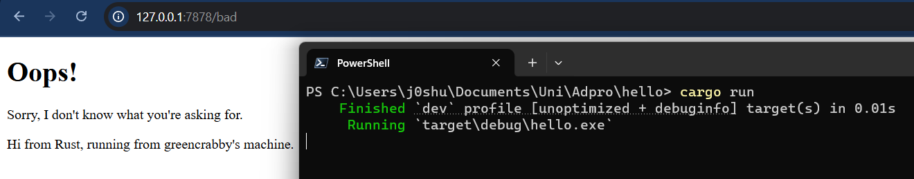

# Module 6
## Commit 1 Reflection Notes
The function `handle_connection`, reads an incoming HTTP request from a `TcpStream`. It creates a buffered reader (`BufReader`) to efficiently read lines from the stream, collecting them into a vector (`http_request`) until it encounters an empty line, which marks the end of the request headers. Finally, it prints the collected request lines for debugging or logging purposes.

## Commit 2 Reflection Notes

The updated `handle_connection` function now not only reads and logs the incoming HTTP request but also responds with the contents of a file, `hello.html`. After reading the request headers, it constructs an HTTP response by setting the status line to `"HTTP/1.1 200 OK"`, reading the file's contents, and determining its length. It then formats the response to include the `Content-Length` header, ensuring proper HTTP formatting. Finally, the function writes the response back to the client using `stream.write_all()`, effectively turning it into a simple web server that serves an HTML page.

## Commit 3 Reflection Notes

In this updated version of the code, the `handle_connection` function has been refactored to improve clarity and maintainability by separating request handling from response generation. Instead of handling the response logic directly within `handle_connection`, the new `generate_response` function determines the appropriate response based on the request. This refactoring makes the code more modular, ensuring that `handle_connection` is only responsible for reading the request and delegating response generation to a dedicated function.

The logic for determining which response to send is now clearly separated. `generate_response` checks if the request matches `"GET / HTTP/1.1"`, in which case it serves `hello.html` with a `200 OK` status. Otherwise, it returns `bad.html` with a `404 NOT FOUND` response, ensuring that users receive meaningful feedback for invalid routes. This separation of concerns is crucial for scalability, if more routes or request types need to be handled in the future, modifications can be made in `generate_response` without cluttering `handle_connection`. The addition of `bad.html` also provides a more user-friendly way to handle errors rather than letting the server fail silently or return a generic response.

## Commit 4 Reflection Notes
When one window accesses the `/sleep` endpoint while another tries to access the main endpoint (`127.0.0.1:7878`), there is a noticeable slowdown. This happens because the `/sleep` endpoint causes the server to pause for 10 seconds, preventing it from handling other requests during that time. Since the server is single-threaded, it processes requests sequentially, meaning any new requests must wait until the current one finishes. As a result, all other requests are blocked until the server completes the `/sleep` request.

## Commit 5 Reflection Notes
The addition of a ThreadPool significantly improves the server's efficiency by enabling it to handle multiple requests concurrently. Previously, the server operated in a single-threaded manner, processing one request at a time. This meant that if a request to the `/sleep` endpoint was made, the entire server would be blocked for 10 seconds, preventing it from responding to other incoming requests. By implementing a thread pool with four worker threads, the server can now distribute incoming requests among multiple threads, allowing up to four requests to be processed simultaneously.

When the server receives a request, it no longer handles it immediately in the main thread. Instead, the request is packaged as a job and placed into a queue managed by the thread pool. Worker threads continuously monitor this queue and execute jobs as they become available. This design prevents the main thread from becoming a bottleneck and ensures that slow or long-running requests do not hinder the responsiveness of the server. For example, when a request to `/sleep` is made, only one of the worker threads will pause for 10 seconds, while the remaining threads remain available to process other requests.

This approach improves performance, as multiple users can access the server without being affected by long-running tasks. It also optimizes resource usage by reusing worker threads instead of creating a new thread for each request, which would be inefficient. By transitioning from a sequential request-handling model to a concurrent one, the server becomes more scalable and capable of handling higher traffic without significant slowdowns.

## Commit Bonus Reflection Notes
Using `build` instead of `new` provides a more descriptive and flexible approach to constructing a `ThreadPool`. While `new` is a common convention in Rust for simple struct instantiation, `build` conveys that the function is doing more than just creating an instance, it is actively constructing and configuring the object. This naming choice makes the code more readable and expressive, especially in cases where initialization involves additional setup, such as spawning multiple worker threads and managing shared resources like channels and mutexes.

Additionally, `build` leaves room for future expansion. If the `ThreadPool` were to support configuration options, such as setting priorities, custom shutdown behavior, or dynamic thread allocation, `build` would provide a more intuitive entry point for such enhancements. By using `build`, the intent of constructing a structured and functional thread pool becomes clearer, making the codebase easier to maintain and extend.