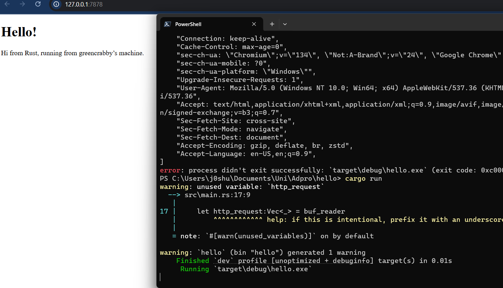

# Module 6
## Commit 1 Reflection Notes
The function `handle_connection`, reads an incoming HTTP request from a `TcpStream`. It creates a buffered reader (`BufReader`) to efficiently read lines from the stream, collecting them into a vector (`http_request`) until it encounters an empty line, which marks the end of the request headers. Finally, it prints the collected request lines for debugging or logging purposes.

## Commit 2 Reflection Notes

The updated `handle_connection` function now not only reads and logs the incoming HTTP request but also responds with the contents of a file, `hello.html`. After reading the request headers, it constructs an HTTP response by setting the status line to `"HTTP/1.1 200 OK"`, reading the file's contents, and determining its length. It then formats the response to include the `Content-Length` header, ensuring proper HTTP formatting. Finally, the function writes the response back to the client using `stream.write_all()`, effectively turning it into a simple web server that serves an HTML page.

